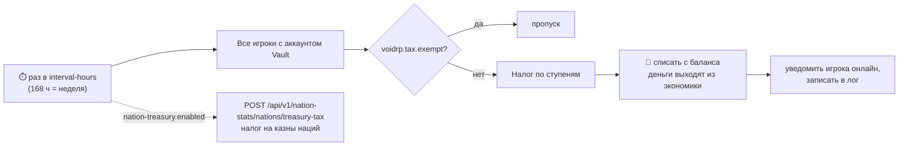

<p align="center"></p>

<div align="center">


[](https://github.com/VOIDRP-MINECRAFT/voidrp-wealth-tax/actions/workflows/build.yml)


</div>

> Paper-плагин VoidRP: прогрессивный налог на богатство, который раз в неделю выводит лишние деньги из экономики,
> чтобы инфляция не обесценивала заработок новых игроков.

---

## 🗺️ Как это работает



## 📈 Ступени (как у прогрессивного налога)

Каждая ставка применяется **только к своей части** баланса:

| Часть баланса | Ставка |
|---|---|
| до 100 000 | 0% |
| 100 000 – 500 000 | 2% |
| 500 000 – 2 000 000 | 5% |
| больше 2 000 000 | 10% |

**Пример:** баланс 1 000 000 → 400 000 × 2% + 500 000 × 5% = **33 000** за неделю.

---

## ⌨️ Команды

| Команда | Что делает |
|---|---|
| `/wealthtax info` (`/tax`, `/налог`) | Когда был последний сбор, когда следующий, интервал |
| `/wealthtax preview` | Сколько заплатил бы каждый игрок прямо сейчас |
| `/wealthtax run` | Собрать налог немедленно |
| `/wealthtax tiers` | Показать ступени |

Все команды — для `voidrp.wealthtax.admin`. Освобождение от налога — право `voidrp.tax.exempt`.

---

## ⚙️ Конфигурация

`plugins/VoidRpWealthTax/config.yml`:

```yaml
interval-hours: 168
notify-online: true
log-to-console: true
tiers:
  - { threshold: 0,       rate: 0.00 }
  - { threshold: 100000,  rate: 0.02 }
  - { threshold: 500000,  rate: 0.05 }
  - { threshold: 2000000, rate: 0.10 }
nation-treasury:          # необязательно: налог на казны наций через бэкенд
  enabled: false
  rate: 0.05
backend:
  url: ""
  game-auth-secret: ""    # X-Game-Auth-Secret этого сервера
  server-slug: ""
```

---

## 🚀 Сборка

```bash
./gradlew build
```

Требования: Paper/Mohist 1.21.1, Java 21, Vault (обязательно), LuckPerms (по желанию).

---

## 🔗 Связанные репозитории

| Репо | Связь |
|---|---|
| [minecraft-backend](https://github.com/VOIDRP-MINECRAFT/minecraft-backend) | Налог на казны наций (`/nation-stats/nations/treasury-tax`) |
| [voidrp-gamesync-plugin](https://github.com/VOIDRP-MINECRAFT/voidrp-gamesync-plugin) | Экономика сервера, казна наций |

---

<div align="center">
<a href="https://void-rp.ru">🌐 Сайт</a> ·
<a href="https://github.com/VOIDRP-MINECRAFT">🏠 Организация</a>
</div>
